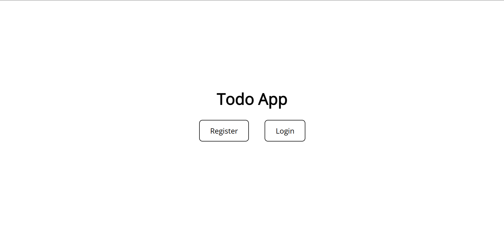
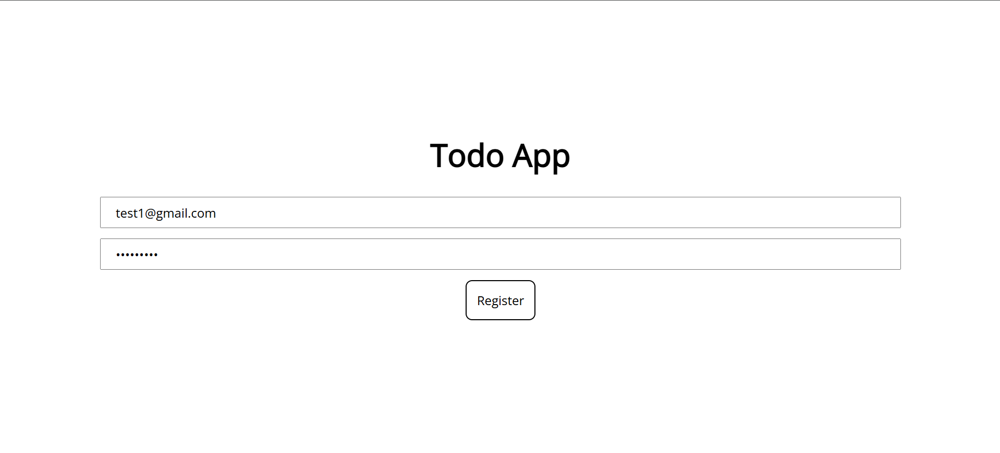
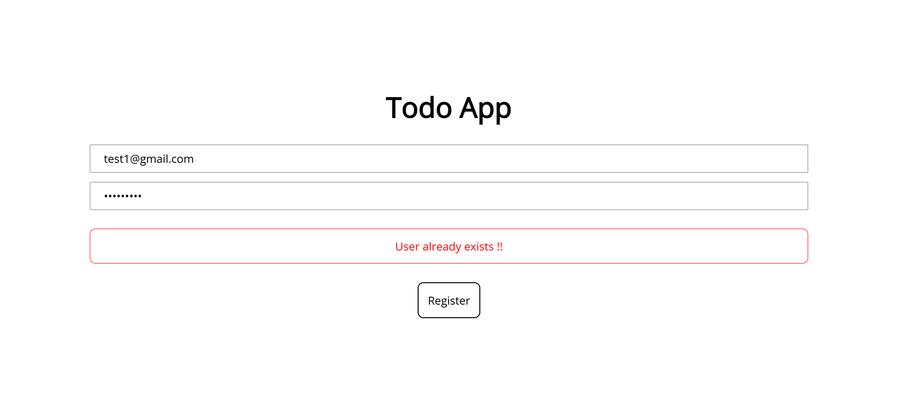
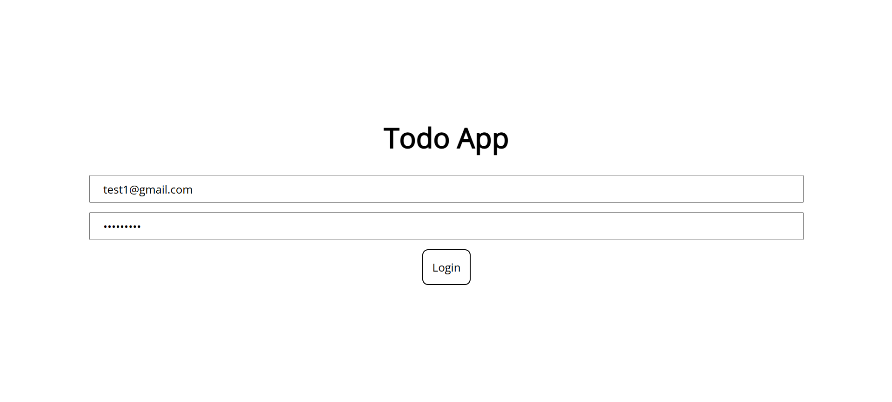
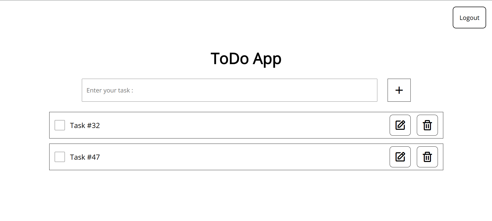

# 📝 Todo List App

A full-stack Todo List application built with Node.js, Express, and PostgreSQL on the backend, and React (Vite) on the frontend. This app allows users to add, edit, delete, and manage their tasks efficiently.

## ⚡ Features

- ✅ Add tasks
- ✏️ Edit tasks
- ❌ Delete tasks
- 📌 Mark tasks as completed
- 📂 Persistent storage with PostgreSQL
- 🔑 User Authentication

## 🛠️ Tech Stack

Frontend :
- React
- Vite
- CSS

Backend :
- Node.js
- Express.js
- PostgreSQL

# 🚀 Getting Started

## 1. Clone the repository

```bash
git clone https://github.com/your-username/todo-list-app.git
cd todo-list-app
```

## 2. Setup Backend

```bash
cd backend
npm install
```

Create a `.env` file inside `backend/`:

```ini
PORT=3000
DATABASE_URL=your_postgres_connection_string
```

Run the backend:

```bash
npm run dev
```

## 3. Setup Frontend

```bash
cd ../frontend
npm install
npm run dev
```

Frontend will run on :
```
http://localhost:5173
```

Backend will run on :
```
http://localhost:3000
```

# 📷 Screenshots

### Main Page


### Register Page


### Register Page with error


### Login Page


### Todo Page


# 📌 API Endpoints

## Normal Routes

| Method | EndPoint | Description |
|:--|:--|:--|
|POST|/auth/register|Register a new user|
|POST|/auth/login|Login and get a new token|

## Protected Routes (Authentication Required)
| Method | EndPoint | Description |
|:--|:--|:--|
|GET|/tasks|Get all tasks|
|POST|/tasks|Create a new task|
|PATCH|/tasks/:id|Updates a task by ID|
|DELETE|/tasks/:id|Deletes a task by ID|

## Middleware Routes
| Method | EndPoint | Description |
|:--|:--|:--|
|POST|/auth/verify|Verifies token validity|

## Contributing
Thank you for checking out my ToDo App!  
Feel free to try it, report issues, or contribute.